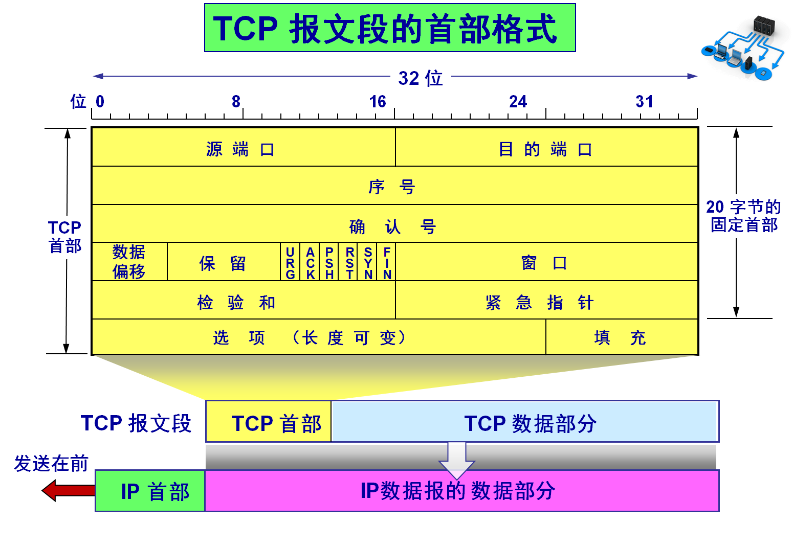

# URL 是个什么东西？

URL（Uniform Resource Locator）是统一资源定位符，是用来定位互联网上的资源的。URL 是互联网上的一个资源的地址，可以是一个网页、图片、视频、音频等等。URL 是互联网上的一个资源的唯一标识，通过 URL 可以找到这个资源。

我们解析 URL 的时候，可以分为五个部分：协议、目标、路径、参数和锚点。

如下图：


- 协议：`http` 是协议，表示资源的传输协议，如 https、ftp、file 等。
- 目标：`www.example.com` 是目标，表示资源的主机地址，它有细分为几个：

  - username：用户名
  - password：密码
  - host：主机地址，包括域名或 ip 地址。
  - port：端口号

- 路径：`/path/to/myfile` 是路径，表示资源的路径，可以是文件路径或目录路径。
- 参数：`?key1=value1&key2=value2` 是参数，表示资源的参数，可以是多个参数，参数之间用 `&` 分隔。
- 锚点：`#SomeWhereInTheDocument` 是锚点，表示资源的锚点，用于页面内的跳转。

接下来我们分别解析这五个部分。

## 协议

协议通俗的讲：它规定了服务通讯的格式和规则，也就是话术。对于一个 URL 地址来说，协议由协议名称 + 冒号组成，如：http、https、ftp、file 等。

当我们在浏览器输入一个 URL 地址时，浏览器会根据协议来选择合适的处理方式，如我们的样例： <http://www.example.com。> 浏览器会在 TCP 连接成功之后发送如下内容：

```shell
GET / HTTP/1.1
Host: www.example.com
Accept: */*
Content-Type: application/x-www-form-urlencoded
User-Agent: Mozilla/5.0 (Windows NT 10.0; Win64; x64) AppleWebKit/537.36 (KHTML, like Gecko) Chrome/58.0.3029.110 Safari/537.3
Cookie: ...
```

## 目标

目标是我们访问主机的地址，可以是 ip 地址，也可以是域名。同时，也可以附带一些认证信息，如用户名和密码。

### 域名

域名是 ip 地址的别名，是为了方便记忆而设置的。域名是由一串用点分隔的名字组成，如：`www.example.com`。域名是有层级的，从右到左依次是顶级域名、二级域名、三级域名等。 域名是一个树形结构，它从根域名开始，结构如下：


- 根域名：所有域名的起点都是根域名，它写作一个点.，放在域名的结尾。因为这部分对于所有域名都是相同的，所以就省略不写了，比如 example.com 等同于 example.com.（结尾多一个点）。

你可以试试，任何一个域名结尾加一个点，浏览器都可以正常解读。

- 顶级域名：根域名的下一级是顶级域名。它分成两种：通用顶级域名（gTLD，比如 .com 和 .net）和国别顶级域名（ccTLD，比如 .cn 和 .us）。

顶级域名由国际域名管理机构 ICANN 控制，它委托商业公司管理 gTLD，委托各国管理自己的国别域名。

- 一级域名： 这是域名的最高层级，通常由一个顶级域名（Top-level Domain，TLD）和一个域名注册商的名称组成。比如，example.com 就是在顶级域名.com + 注册的名称。

- 二级域名： 这是在一级域名之下的一个更具体的子域名，一般体现具体的职责和用途，如 mail.163.com、news.163.com 等。

- 三级域名： 这是在二级域名之下的一个更具体的子域名，一般体现具体的职责和用途，如 www.mail.163.com、news.mail.163.com 等。

说到域名，就不得不提域名解析系统（Domain Name System，DNS），它是互联网的一项核心服务，它可以将域名和 IP 地址相互映射的分布式数据库，能够使人更方便地访问互联网。

既然说到 DNS，我们不妨将它的工作原理也介绍一下。它的工作流程如下：

1. 浏览器缓存：浏览器会先在自己的缓存中查找域名对应的 IP 地址，如果有，直接返回。

对于 chrome 浏览器，你可以通过在地址栏输入 `chrome://net-internals/#dns` 查看浏览器的 DNS 缓存。

2. 系统`hosts`文件和系统缓存，首先检查域名存在`hosts`文件配置，如果存在则直接返回，否则查找系统缓存中是否有域名对应的 IP 地址，如果有，直接返回。

- `hosts`文件是一个计算机文件，它用于将 IP 地址映射到主机名。在 Windows 系统中，`hosts`文件位于`C:\Windows\System32\drivers\etc\hosts`；在 Linux 系统中，`hosts`文件位于`/etc/hosts`。

- 对于 windows 系统而言，可以通过命令`ipconfig /flushdns`清理系统 DNS 缓存。

- 对于 Mac 系统而言，可以通过命令`sudo killall -HUP mDNSResponder`清理系统 DNS 缓存。

- 对 Linux 系统而言，可以通过命令`sudo /etc/init.d/nscd restart`清理系统 DNS 缓存。

3. 本地 DNS 服务器：如果在本地缓存中没有找到，那么就会向本地 DNS 服务器发起请求。

关于本地 DNS 服务器的搭建，有兴趣的同学可以查看下附录： 本地 DNS 服务器搭建

4. 根域名服务器：本地 DNS 服务器向根域名服务器发起请求，根域名服务器返回顶级域名服务器的地址。

5. 顶级域名服务器：本地 DNS 服务器向顶级域名服务器发起请求，顶级域名服务器返回权威域名服务器的地址。

6. 权威域名服务器：本地 DNS 服务器向权威域名服务器发起请求，权威域名服务器返回域名对应的 IP 地址。

7. 本地 DNS 服务器：本地 DNS 服务器将 IP 地址返回给浏览器，浏览器将 IP 地址缓存到本地。

8. 浏览器：浏览器向 IP 地址发起请求，获取资源。

经过轮询之后，本地 DNS 服务器会、本机将域名对应的 IP 地址缓存到本地，下次再访问相同的域名时，就可以直接从本地缓存中获取 IP 地址，不用再次向根域名服务器发起请求。

所以，对于首次访问的域名，会比较慢。

有兴趣的同学可以看下附录： DNS 协议内容

## 端口

端口是网络请求发起请求的通道，端口的定义是由 TCP 协议确定的，它是一个 16 位的整数，范围是 0-65535，其中 0-1023 是系统保留端口，一般用于系统服务，如 HTTP 服务的默认端口是 80，HTTPS 服务的默认端口是 443。

常见的端口有：

- 21：FTP 服务
- 22：SSH 服务
- 23：Telnet 服务
- 25：SMTP 服务
- 53：DNS 服务
- 80：HTTP 服务
- 110：POP3 服务
- 143：IMAP 服务
- 443：HTTPS 服务
- 2181：Zookeeper 服务
- 3306：MySQL 服务
- 3389：远程桌面服务
- 6379：Redis 服务默认端口
- 8080：Tomcat 服务默认端口

当我们深究端口时，不妨看一下 TCP 协议，其请求报文如下：



可以看出`源端口`和`目的端口`，这也解释了为什么端口范围是 0-65535，因为协议只预留了 16 位的长度。

其中源端口客户端所分配的端口，这个端口是随机的（但是它又满足一定的条件，后续我们将介绍到），目的端口一般是服务端的端口，如上面说的 http 协议的默认端口是 80。

## 路径

路径是资源的地址，可以是文件路径或目录路径，如：`/path/to/myfile`。

## 参数

参数是请求资源时同时带给服务器的数据，它由三部分组成：

- 问号(?)，作为参数的开始。

- 参数名和值，它严格按照`key=value`的格式，key 和 value 都需要进行 URL Encode 编码（详细见下文）。

- 连接符(&)，用于连接多个参数。

如：`?key1=value1&key2=value2`。

### URL Encode 与 URL Decode

`key`和`value`都需要进行 URL Encode 编码，URL Encode 是一种编码方式，用于将 URL 中的特殨字符转换为 `%` 加上两位十六进制数，比如`?name=张三&age=18`，经过 URL Encode 编码后，变成：`?name=%E5%BC%A0%E4%B8%89&age=18`。

javascript 中可以使用`encodeURIComponent`将字符串进行 URL Encode 编码。根据 MDN 的介绍

> encodeURIComponent() 函数通过将特定字符的每个实例替换成代表字符的 UTF-8 编码的一个、两个、三个或四个转义序列来编码 URI（只有由两个“代理”字符组成的字符会被编码为四个转义序列）。

而`decodeURIComponent`函数则`encodeURIComponent`的逆操作。

当然这里面说的`UTF-8`编码并不是固定的，也可以使用其他编码，只需要对应的`decodeURIComponent`保持一致即可。

## 附录 I：域名解析的分类

共同实现 DNS 分布式数据库的所有 DNS 服务器存储了资源记录(Resource Record, RR)，RR 提供了主机名到 IP 地址的映射。每个 DNS 回答报文中会包含一条或多条资源记录。RR 记录用于回复客户端查询。

资源记录是一个包含了下列字段的 4 元组

```bash
(Name, Value, Type, TTL)
```

RR 会有不同的类型，下面是不同类型的 RR 汇总表

| DNS RR 类型 | 解释                                        |
| ----------- | ------------------------------------------- |
| A 记录      | IPv4 主机记录，用于将域名映射到 IPv4 地址   |
| AAAA 记录   | IPv6 主机记录，用于将域名映射到 IPv6 地址   |
| CNAME 记录  | 别名记录，用于映射 DNS 域名的别名           |
| MX 记录     | 邮件交换器，用于将 DNS 域名映射到邮件服务器 |
| PTR 记录    | 指针，用于反向查找（IP 地址到域名解析）     |
| SRV 记录    | SRV 记录，用于映射可用服务                  |
| TXT 记录    | 文本记录，用于包含任意文本                  |

一般用得比较多的是`A`、`AAAA`、`CNAME`、`TXT`。

## 附录 II： DNS 协议内容

## 附录 III: 本地 DNS 服务器的搭建

通过上面的介绍，我们知道了 DNS 的工作原理，那么我们可以自己搭建一个本地 DNS 服务器，来加深对 DNS 的理解。

本地 DNS 服务器搭建，通常使用`bind`软件，它是一个开源的 DNS 服务器软件，可以在 Linux、Windows、Mac 等系统上运行。

下面我们以在`Linux`系统上搭建`bind`为例，介绍一下搭建过程。

### 安装 bind

```bash
yum install bind bind-utils -y
```

安装成功后，配置自启动：

```bash
systemctl enable named
```

如果没有启动成功，则可以通过下面的命令启动：

```bash
systemctl start named
```

### 配置 bind

bind 涉及多个配置文件，我们简单列举一下：

```bash
/etc/named.conf              # bind主配置文件
/etc/named.rfc1912.zones     # 定义zone的文件
/etc/rc.d/init.d/named       # bind脚本文件
/etc/rndc.conf               # rndc配置文件
/usr/sbin/named-checkconf    # 检测/etc/named.conf文件语法
/usr/sbin/named-checkzone    # 检测zone和对应zone文件的语法
/usr/sbin/rndc               # 远程dns管理工具
/usr/sbin/rndc-confgen       # 生成rndc密钥
/var/named/named.ca          # 根解析库
/var/named/named.localhost   # 本地主机解析库
/var/named/slaves            # 从ns服务器文件夹
```

其中主要的配置文件是`/etc/named.conf`。

它包括：

主配置文件/etc/named.conf 包括：

- 监听端口(listen-on port)和 ip 地址
- 服务作用范围（本机还是指定网段还是全网）（allow-query）
- 递归还是迭代查询(recursion)
- 根区域解析文件（zone），其他区域文件可以看到有个 include “/etc/named.rfc1912.zones”;，这下面保存了 localhost 的区域文件，如果新添加的，卸载这个 zones 文件里，里面指向了 zone 文件地址。然后每一个 zone 文件，是在/var/named 下面。

```config
options {
   listen-on port 53 { 127.0.0.1; };// ipv4监听端口和ip地址，默认只有本地的
   listen-on-v6 port 53 { ::1; }; // ipv6的监听端口和ip地址
   directory    "/var/named";
   dump-file    "/var/named/data/cache_dump.db";
   statistics-file "/var/named/data/named_stats.txt";
   memstatistics-file "/var/named/data/named_mem_stats.txt";
   allow-query     { localhost; };

   /*
    - If you are building an AUTHORITATIVE DNS server, do NOT enable recursion.
    - If you are building a RECURSIVE (caching) DNS server, you need to enable
      recursion.
    - If your recursive DNS server has a public IP address, you MUST enable access
      control to limit queries to your legitimate users. Failing to do so will
      cause your server to become part of large scale DNS amplification
      attacks. Implementing BCP38 within your network would greatly
      reduce such attack surface
   */
   recursion yes; // 递归还是迭代查询

   dnssec-enable yes; // dns安全扩展,可以改为no关闭
   dnssec-validation yes; //可以改为no关闭

   /* Path to ISC DLV key */
   bindkeys-file "/etc/named.iscdlv.key";

   managed-keys-directory "/var/named/dynamic";

   pid-file "/run/named/named.pid";
   session-keyfile "/run/named/session.key";
};

logging {
        channel default_debug {
                file "data/named.run";
                severity dynamic;
        };
};

zone "." IN { // 定义zone文件，这里是定义的根域的文件位置
   type hint;
   file "named.ca";
};

include "/etc/named.rfc1912.zones"; // 把named.rfc1912.zones文件包含进来
include "/etc/named.root.key"; // 把/etc/named.root.key文件包含进来
```
