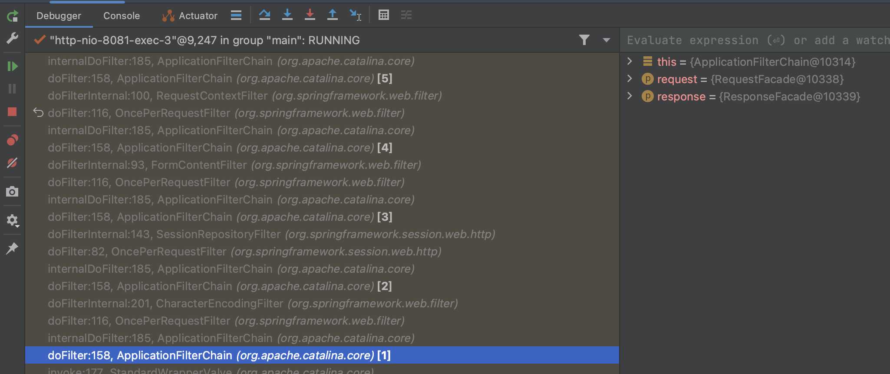

# Spring 如何实现分布式会话

上一章我们讲述了`Spring Boot` + `Redis`实现分布式会话，这一章我们将讲述它们是如何实现的。

## 从入口开始

### Filter 的定义

在实现过程中我们引入了`@EnableRedisHttpSession`注解，如下：

```javas
@EnableRedisHttpSession
@SpringBootApplication
class Main {
    public static void main(String[] args) {
        SpringApplication.run(Main.class, args);
    }
}
```

那么@`EnableRedisHttpSession`做了什么呢 ？

```java
@Retention(RetentionPolicy.RUNTIME)
@Target({ElementType.TYPE})
@Documented
@Import({RedisHttpSessionConfiguration.class})
public @interface EnableRedisHttpSession {
  int maxInactiveIntervalInSeconds() default 1800;

  String redisNamespace() default "spring:session";

  FlushMode flushMode() default FlushMode.ON_SAVE;

  SaveMode saveMode() default SaveMode.ON_SET_ATTRIBUTE;
}
```

`@EnableRedisHttpSession`注解是一个组合注解，它引入了`RedisHttpSessionConfiguration`配置类，如下：

```java
@Configuration(proxyBeanMethods = false)
public class RedisHttpSessionConfiguration extends AbstractRedisHttpSessionConfiguration<RedisSessionRepository> implements EmbeddedValueResolverAware, ImportAware {
}
```

我们看到，其增加了`@Configuration`注解，这意味着它是一个配置类。同时它继承了`AbstractRedisHttpSessionConfiguration`

```java
@Configuration(proxyBeanMethods = false)
@Import(SpringHttpSessionConfiguration.class)
public abstract class AbstractRedisHttpSessionConfiguration<T extends SessionRepository<? extends Session>> implements BeanClassLoaderAware {

}
```

`AbstractRedisHttpSessionConfiguration`是一个抽象类，它引入了`SpringHttpSessionConfiguration`配置类，如下：

```java
@Configuration(proxyBeanMethods = false)
public class SpringHttpSessionConfiguration {
 @Bean
 public <S extends Session> SessionRepositoryFilter<? extends Session> springSessionRepositoryFilter(
   SessionRepository<S> sessionRepository) {
  SessionRepositoryFilter<S> sessionRepositoryFilter = new SessionRepositoryFilter<>(sessionRepository);
  sessionRepositoryFilter.setHttpSessionIdResolver(this.httpSessionIdResolver);
  return sessionRepositoryFilter;
 }
}
```

至此，我们找到了 Filter 的定义逻辑，定义了一个 SessionRepositoryFilter，它的定义我们也简单看下。

```java
public class SessionRepositoryFilter<S extends Session> extends OncePerRequestFilter {}
```

```java
abstract class OncePerRequestFilter implements Filter {}
```

`SessionRepositoryFilter`继承了`OncePerRequestFilter`，`OncePerRequestFilter`继承了`Filter`，这意味着`SessionRepositoryFilter`是一个过滤器。

我们知道，Filter 要实现效果，必须注册到`Servlet`容器中，那么`SessionRepositoryFilter`是如何注册到`Servlet`容器中的呢？我们回顾一下`Filter`的注册方式，主要有三种：

1. 通过`web.xml`进行注册

2. servlet3.0 之后，通过`@WebFilter`注解进行注册

3. servlet3.0 之后，通过容器函数添加：

```java
servletContext.addFilter("sessionRepositoryFilter", sessionRepositoryFilter)
    .addMappingForUrlPatterns(EnumSet.of(DispatcherType.REQUEST, DispatcherType.ERROR), false, "/*");
```

SpringBoot 利用了第三种方式。具体方式我们进一步探索。

### Filter 注册

基于`SpringBoot`的自动配置机制，我们从服务的启动开始，以`tomcat`为例

```java
public class ServletWebServerApplicationContext extends GenericWebApplicationContext
implements ConfigurableWebServerApplicationContext {
  private void createWebServer() {
    WebServer webServer = this.webServer;
    ServletContext servletContext = getServletContext();
    if (webServer == null && servletContext == null) {
    StartupStep createWebServer = getApplicationStartup().start("spring.boot.webserver.create");
    ServletWebServerFactory factory = getWebServerFactory();
    createWebServer.tag("factory", factory.getClass().toString());
    this.webServer = factory.getWebServer(getSelfInitializer());
    createWebServer.end();
    getBeanFactory().registerSingleton("webServerGracefulShutdown",
      new WebServerGracefulShutdownLifecycle(this.webServer));
    getBeanFactory().registerSingleton("webServerStartStop",
      new WebServerStartStopLifecycle(this, this.webServer));
    }
    else if (servletContext != null) {
    try {
      getSelfInitializer().onStartup(servletContext);
    }
    catch (ServletException ex) {
      throw new ApplicationContextException("Cannot initialize servlet context", ex);
    }
    }
    initPropertySources();
 }
}
```

其中`getSelfInitializer`返回容器初始化之后的处理逻辑，其定义如下：

```java
  private org.springframework.boot.web.servlet.ServletContextInitializer getSelfInitializer() {
  return this::selfInitialize;
 }

 private void selfInitialize(ServletContext servletContext) throws ServletException {
  prepareWebApplicationContext(servletContext);
  registerApplicationScope(servletContext);
  WebApplicationContextUtils.registerEnvironmentBeans(getBeanFactory(), servletContext);
  for (ServletContextInitializer beans : getServletContextInitializerBeans()) {
   beans.onStartup(servletContext);
  }
 }
```

`selfInitialize`方法中，我们看到了`ServletContextInitializer`的调用，`ServletContextInitializer`是一个接口，它的定义如下：

```java
@FunctionalInterface
public interface ServletContextInitializer {

 /**
  * Configure the given {@link ServletContext} with any servlets, filters, listeners
  * context-params and attributes necessary for initialization.
  * @param servletContext the {@code ServletContext} to initialize
  * @throws ServletException if any call against the given {@code ServletContext}
  * throws a {@code ServletException}
  */
 void onStartup(ServletContext servletContext) throws ServletException;
}
```

那么哪些实现了`ServletContextInitializer`接口呢？通过寻找我们发现了其中一个实现类`FilterRegistrationBean`。同时在`autoconfigure`找到了 bean `FilterRegistrationBean`的注册逻辑。

```java
@Configuration(proxyBeanMethods = false)
@ConditionalOnBean(SessionRepositoryFilter.class)
@EnableConfigurationProperties(SessionProperties.class)
class SessionRepositoryFilterConfiguration {
 @Bean
 FilterRegistrationBean<SessionRepositoryFilter<?>> sessionRepositoryFilterRegistration(
   SessionProperties sessionProperties, SessionRepositoryFilter<?> filter) {
  FilterRegistrationBean<SessionRepositoryFilter<?>> registration = new FilterRegistrationBean<>(filter);
  registration.setDispatcherTypes(getDispatcherTypes(sessionProperties));
  registration.setOrder(sessionProperties.getServlet().getFilterOrder());
  return registration;
 }
}
```

可以看到`SessionRepositoryFilterConfiguration`注册了一个`FilterRegistrationBean`。我们在
其父类`AbstractFilterRegistrationBean`找到了注册逻辑。

```java
public abstract class AbstractFilterRegistrationBean<T extends Filter> extends DynamicRegistrationBean<Dynamic> {
 @Override
 protected Dynamic addRegistration(String description, ServletContext servletContext) {
  Filter filter = getFilter();
  return servletContext.addFilter(getOrDeduceName(filter), filter);
 }
}
```

其利用 Servlet 容器的`addFilter`方法注册了`Filter`。

我们简单总结一下，其内部调用为：

1. `TomcatStarter` 的 `onStartup` 回调，其调用所有注册的`ServletContextInitializer`。
2. `ServletWebServerApplicationContext`的`selfInitialize`方法被调用，其调用所有注册至 Spring 容器的`ServletContextInitializer`。
3. `RegistrationBean`的`onStartup`回调，其调用子类的`register`实现方法。
4. `DynamicRegistrationBean`的`register`方法，其调用子类的`addRegistration`实现方法。
5. `AbstractFilterRegistrationBean`的`addRegistration`方法，其调用`ServletContext`的`addFilter`方法。

至此，我们找到了`Filter`的注册逻辑。

## Filter 的执行

接下来我们思考一个问题，Filter 它做了什么，主要是回答两个问题：

1. 为什么通过`getSession`就可以获取到存储在`redis`中的`session`呢？
2. `Filter`是如何将`session`存储到`redis`中的呢？

我们先看第一个问题，`Filter`如何从`redis`中获取`session`。我们知道 servlet 规范中，利用`request`的`getSession`方法获取当前 session，那么我们能不能将将方法进行劫持呢？答案是肯定的。

### 先从`ServletRequest`和`Filter`讲起

`ServletRequest`是一个接口，它定义一些统一的接口，`HttpServletRequest`是其子接口，它定义了一些`HTTP`相关的接口。我们截取其关于 Session 的接口定义。

```java
public interface HttpServletRequest extends ServletRequest {
  HttpSession getSession();
  HttpSession getSession(boolean create);
  public String changeSessionId();
  public boolean isRequestedSessionIdValid();
  public boolean isRequestedSessionIdFromCookie();
  public boolean isRequestedSessionIdFromURL();
}
```

其中`changeSessionId`、`isRequestedSessionIdFromCookie`、`isRequestedSessionIdFromURL`方法是`Servlet3.1`新增的方法。定义如下：

- `changeSessionId`用于更改`session`的`id`。
- `isRequestedSessionIdFromCookie`和`isRequestedSessionIdFromURL`方法用于判断`session`的来源。

其中，`getSession`便涉及`session`的获取。

再回头来说`Filter`，了解 Servlet 的同学都知道，`Filter`是一个过滤器，它可以拦截请求，对请求进行处理。`Filter`的定义如下：

```java
public interface Filter {
  void init(FilterConfig filterConfig) throws ServletException;
  void doFilter(ServletRequest request, ServletResponse response, FilterChain chain) throws IOException, ServletException;
  void destroy();
}
```

其中`init`和`destroy`随容器的启动和关闭而调用，`doFilter`方法是核心方法，它接收`ServletRequest`和`ServletResponse`，以及`FilterChain`，`FilterChain`是一个链，它包含了所有匹配的`Filter`。

这个是一个典型的洋葱模型，请求从外到内，响应从内到外，Filter 之间的调用顺序则由注册顺序决定。

### `SessionRepositoryFilter`的实现

我们在`SessionRepositoryFilter`打一个断点，监听请求的处理情况。如下图：



从下往上，分别经历了 CharacterEncodingFilter、SessionRepositoryFilter、FormContentFilter、
RequestContextFilter、WsFilter。

我们看到`SessionRepositoryFilter`的`doFilterInternal`方法，如下：

```java
@Order(SessionRepositoryFilter.DEFAULT_ORDER)
public class SessionRepositoryFilter<S extends Session> extends OncePerRequestFilter {
 @Override
 protected void doFilterInternal(HttpServletRequest request, HttpServletResponse response, FilterChain filterChain)
   throws ServletException, IOException {
  request.setAttribute(SESSION_REPOSITORY_ATTR, this.sessionRepository);

  // 重载 request
  SessionRepositoryRequestWrapper wrappedRequest = new SessionRepositoryRequestWrapper(request, response);
  SessionRepositoryResponseWrapper wrappedResponse = new SessionRepositoryResponseWrapper(wrappedRequest,
    response);

  try {
   filterChain.doFilter(wrappedRequest, wrappedResponse);
  }
  finally {
   // 提交 session
   wrappedRequest.commitSession();
  }
 }
}
```

我们看到传入的`HttpServletRequest`被封装成`SessionRepositoryRequestWrapper`，并传递给下游。

#### `SessionRepositoryRequestWrapper`的实现

`SessionRepositoryRequestWrapper`是一个`HttpServletRequestWrapper`子类，它的定义如下：

```java
private final class SessionRepositoryRequestWrapper extends HttpServletRequestWrapper {
  public HttpSessionWrapper getSession(boolean create) {}
  public HttpSessionWrapper getSession() {
    return getSession(true);
  }
}
```

其重载了`getSession`方法。详细逻辑如下：

```java
public HttpSessionWrapper getSession(boolean create) {
   // 1. 检查requset中是否换成session
   HttpSessionWrapper currentSession = getCurrentSession();
   if (currentSession != null) {
    return currentSession;
   }
   // 2. 从redis中还原session
   S requestedSession = getRequestedSession();
   if (requestedSession != null) {
    if (getAttribute(INVALID_SESSION_ID_ATTR) == null) {
     requestedSession.setLastAccessedTime(Instant.now());
     this.requestedSessionIdValid = true;
     currentSession = new HttpSessionWrapper(requestedSession, getServletContext());
     currentSession.markNotNew();
     setCurrentSession(currentSession);
     return currentSession;
    }
   }
   else {
    // This is an invalid session id. No need to ask again if
    // request.getSession is invoked for the duration of this request
    if (SESSION_LOGGER.isDebugEnabled()) {
     SESSION_LOGGER.debug(
       "No session found by id: Caching result for getSession(false) for this HttpServletRequest.");
    }
    setAttribute(INVALID_SESSION_ID_ATTR, "true");
   }
   if (!create) {
    return null;
   }
   if (SessionRepositoryFilter.this.httpSessionIdResolver instanceof CookieHttpSessionIdResolver
     && this.response.isCommitted()) {
    throw new IllegalStateException("Cannot create a session after the response has been committed");
   }
   if (SESSION_LOGGER.isDebugEnabled()) {
    SESSION_LOGGER.debug(
      "A new session was created. To help you troubleshoot where the session was created we provided a StackTrace (this is not an error). You can prevent this from appearing by disabling DEBUG logging for "
        + SESSION_LOGGER_NAME,
      new RuntimeException("For debugging purposes only (not an error)"));
   }
   // 3. 新建session
   S session = SessionRepositoryFilter.this.sessionRepository.createSession();
   session.setLastAccessedTime(Instant.now());
   currentSession = new HttpSessionWrapper(session, getServletContext());
   setCurrentSession(currentSession);
   return currentSession;
  }
```

从上述代码我们可以看到，整个流程核心分为三步：

1. 检查`request`中是否包含`session`，如果包含则直接返回。

2. 从`redis`中还原`session`，如果`session`存在则直接返回。

3. 如果`session`不存在，则新建一个`session`。

我们进一部分分析第二步，从`redis`中还原`session`。我们看到`getRequestedSession`方法，如下：

```java
private S getRequestedSession() {
   if (!this.requestedSessionCached) {
    List<String> sessionIds = SessionRepositoryFilter.this.httpSessionIdResolver.resolveSessionIds(this);
    for (String sessionId : sessionIds) {
     if (this.requestedSessionId == null) {
      this.requestedSessionId = sessionId;
     }
     S session = SessionRepositoryFilter.this.sessionRepository.findById(sessionId);
     if (session != null) {
      this.requestedSession = session;
      break;
     }
    }
    this.requestedSessionCached = true;
   }
   return this.requestedSession;
  }
```

这里面引入了两个概念： `httpSessionIdResolver` 和 `sessionRepository`，它们均是 SessionRepositoryFilter 的属性。由于`SessionRepositoryRequestWrapper`是`SessionRepositoryFilter`的内部类，所以可以直接访问`SessionRepositoryFilter`的属性。

#### `httpSessionIdResolver`的实现

HttpSessionIdResolver 是啥？它的作用是啥？这个 Spring 的灵活之处。我们知道，http 的无状态性，它需要携带一个 session id 来标识用户。它的传递有几种方式：

- 通过 URL 传递 sessionId，如`http://localhost:8080/index;jsessionid=xxx`

- 通过 Cookie 传递 sessionId，如`Cookie: JSESSIONID=xxx`

- 通过 Header 传递 sessionId，如`X-Session-Id: xxx`

为了适应不同的场景，Spring 提供了`HttpSessionIdResolver`接口，它的定义如下：

```java
public interface HttpSessionIdResolver {
  List<String> resolveSessionIds(HttpServletRequest request);
  void setSessionId(HttpServletRequest request, HttpServletResponse response, String sessionId);
  void expireSession(HttpServletRequest request, HttpServletResponse response);
}
```

Spring 提供了两种通用实现：`CookieHttpSessionIdResolver`和`HeaderHttpSessionIdResolver`。此处我们就不展开阐述了。默认的`httpSessionIdResolver`是`CookieHttpSessionIdResolver`，其识别名为`SESSION`的 cookie。也可以使用其他的`HttpSessionIdResolver`，有兴趣的同学可以去了解内部实现。

#### `sessionRepository`的实现

根据上述代码，我们知道`HttpSessionIdResolver`解析出多个 sessionId，`sessionRepository`调用`findById`方法逐个查询，直至找到对应的`Session`信息。

`SessionRepository`是一个接口，它定义了几个通用的方法，如下：

```java
public interface SessionRepository<S extends Session> {
  S createSession();
  void save(S session);
  S findById(String id);
  void deleteById(String id);
}
```

它的实现类包括：

- MapSessionRepository

- RedisIndexedSessionRepository

- RedisSessionRepository

我们回顾上面讲到的`SessionRepositoryFilter`的初始化，传入`sessionRepository`对象，它的管理也依赖于 Spring 容器的管理。

那么，我们接下来弄清楚几个问题：

- `SessionRepository`是如何初始化的？

- `SessionRepository`的`findById`做了啥？

1. `SessionRepository`的初始化

首先，我们在入口类使用了`@EnableRedisHttpSession`注解，如下：

```java
@EnableRedisHttpSession
public class Main {}
```

`@EnableRedisHttpSession`注解引入了`RedisHttpSessionConfiguration`配置类，如下：

```java
@Retention(RetentionPolicy.RUNTIME)
@Target(ElementType.TYPE)
@Documented
@Import(RedisHttpSessionConfiguration.class)
public @interface EnableRedisHttpSession { }
```

`RedisHttpSessionConfiguration`配置类定义了@Bean 注解的方法`sessionRepository`，如下：

```java
@Configuration(proxyBeanMethods = false)
public class RedisHttpSessionConfiguration extends AbstractRedisHttpSessionConfiguration<RedisSessionRepository>
  implements EmbeddedValueResolverAware, ImportAware {

@Bean
@Override
public RedisSessionRepository sessionRepository() {
  RedisTemplate<String, Object> redisTemplate = createRedisTemplate();
  RedisSessionRepository sessionRepository = new RedisSessionRepository(redisTemplate);
  sessionRepository.setDefaultMaxInactiveInterval(getMaxInactiveInterval());
  if (StringUtils.hasText(getRedisNamespace())) {
  sessionRepository.setRedisKeyNamespace(getRedisNamespace());
  }
  sessionRepository.setFlushMode(getFlushMode());
  sessionRepository.setSaveMode(getSaveMode());
  getSessionRepositoryCustomizers()
    .forEach((sessionRepositoryCustomizer) -> sessionRepositoryCustomizer.customize(sessionRepository));
  return sessionRepository;
}
}

```

因此，我们总结其初始化流程为：

- `@EnableRedisHttpSession`注解引入`RedisHttpSessionConfiguration`配置类

- `RedisHttpSessionConfiguration`配置类包含`@Bean`注解解释的方法`sessionRepository`。

2. `SessionRepository`的`findById`方法

有上述分析知道，`SessionRepository`实际上使用的是`RedisSessionRepository`的实例。

其`findById`方法如下：

```java
public class RedisSessionRepository implements SessionRepository<RedisSession> {
@Override
  public RedisSession findById(String sessionId) {
    String key = getSessionKey(sessionId);
    Map<String, Object> entries = this.sessionRedisOperations.<String, Object>opsForHash().entries(key);
    if (entries.isEmpty()) {
      return null;
    }
    MapSession session = new RedisSessionMapper(sessionId).apply(entries);
    if (session.isExpired()) {
      deleteById(sessionId);
      return null;
    }
    return new RedisSession(session, false);
  }
}
```

我们依次分析：

- `getSessionKey`方法用于获取`session`的`key`。其定义如下：

  ```java
  private String getSessionKey(String sessionId) {
    return this.keyNamespace + "sessions:" + sessionId;
  }
  ```

  那么，`keyNamespace`是如何来的呢？ 进一步检索，你会发现`keyNamespace`默认值为：

  ```java
  public static final String DEFAULT_KEY_NAMESPACE = "spring:session";
  private String keyNamespace = DEFAULT_KEY_NAMESPACE + ":";
  ```

  即，`keyNamespace`默认值为`spring:session:`。同时`keyNamespace`提供了 set 方法，可以自定义`keyNamespace`。篇幅限制，这里直接给出结论，设置`keyNamespace`有两种方式：

  - 通过`application.yml`配置文件设置`spring.session.redis.namespace`属性。
  - 通过注解@EnableRedisHttpSession 的`redisNamespace`属性设置。

  其中，通过配置文件的优先级要高于注解。

- 通过`sessionRedisOperations`获取`session`信息，`sessionRedisOperations`是`RedisTemplate`的实例，其定义如下：

  ```java
  private final RedisOperations<String, Object> sessionRedisOperations;
  ```

  `RedisTemplate`是`Spring`对`Redis`的封装，它提供了一系列的操作方法。在生成`SessionRepository`实例时，使用了`createTemplate`方法，其定义如下：

  ```java
  protected RedisTemplate<String, Object> createRedisTemplate() {
    RedisTemplate<String, Object> redisTemplate = new RedisTemplate<>();
    redisTemplate.setKeySerializer(new StringRedisSerializer());
    redisTemplate.setHashKeySerializer(new StringRedisSerializer());
    if (getDefaultRedisSerializer() != null) {
    redisTemplate.setDefaultSerializer(getDefaultRedisSerializer());
    }
    redisTemplate.setConnectionFactory(getRedisConnectionFactory());
    redisTemplate.setBeanClassLoader(this.classLoader);
    redisTemplate.afterPropertiesSet();
    return redisTemplate;
  }
  ```

  我们可以看到 RedisTemplate 包含几个比较重要的属性：

  - keySerializer：key 的序列化器
  - hashKeySerializer：hash key 的序列化器
  - defaultSerializer：默认的序列化器，用于序列化 value
  - connectionFactory：连接工厂，通过 Spring 容器自动管理 redis 连接；

  既然讲到这里了，我们不妨再进一步看下 redis 存储的数据是怎么样的？

  通过查看 redis 数据，redis 其中一个数据如下：

  ```bash
  hgetall spring:session:sessions:c89dde1e-db1a-46d6-ae0f-330d821a411b
    1) "maxInactiveInterval"
    2) "\xac\xed\x00\x05sr\x00\x11java.lang.Integer\x12\xe2\xa0\xa4\xf7\x81\x878\x02\x00\x01I\x00\x05valuexr\x00\x10java.lang.Number\x86\xac\x95\x1d\x0b\x94\xe0\x8b\x02\x00\x00xp\x00\x00\a\b"
    3) "sessionAttr:iCount"
    4) "\xac\xed\x00\x05sr\x00\x11java.lang.Integer\x12\xe2\xa0\xa4\xf7\x81\x878\x02\x00\x01I\x00\x05valuexr\x00\x10java.lang.Number\x86\xac\x95\x1d\x0b\x94\xe0\x8b\x02\x00\x00xp\x00\x00\x00\x04"
    5) "creationTime"
    6) "\xac\xed\x00\x05sr\x00\x0ejava.lang.Long;\x8b\xe4\x90\xcc\x8f#\xdf\x02\x00\x01J\x00\x05valuexr\x00\x10java.lang.Number\x86\xac\x95\x1d\x0b\x94\xe0\x8b\x02\x00\x00xp\x00\x00\x01\x908\x81\xda\xda"
    7) "lastAccessedTime"
    8) "\xac\xed\x00\x05sr\x00\x0ejava.lang.Long;\x8b\xe4\x90\xcc\x8f#\xdf\x02\x00\x01J\x00\x05valuexr\x00\x10java.lang.Number\x86\xac\x95\x1d\x0b\x94\xe0\x8b\x02\x00\x00xp\x00\x00\x01\x908\x9aH\xe6"
  ```

  附带一下存储的代码，如下：

  ```java
  public @ResponseBody Map<String, Object> redisGet(HttpSession session) {
    Map<String, Object> map = new HashMap<>();
    map.put("sessionId", session.getId());
    int iCount = 0;
    if (session.getAttribute("iCount") != null) {
        iCount = (int) session.getAttribute("iCount");
    }
    session.setAttribute("iCount", ++iCount);
    map.put("iCount", iCount);
    return map;
  }
  ```

  实际上，我们仅保存的一个`iCount`属性的数据，且该值为一个数字。redis 存储为`sessionAttr:iCount`，值为序列化后的数据。我们马上先到上面提到的`keySerializer`和`defaultSerializer`，难道 key 和 value 都是序列化后的数据吗？

  先看`keySerializer`，其定义如下：

  ```java
  public class StringRedisSerializer implements RedisSerializer<String> {
    private final Charset charset;
    public StringRedisSerializer() {
      this(StandardCharsets.UTF_8);
    }

    public StringRedisSerializer(Charset charset) {
      Assert.notNull(charset, "Charset must not be null");
      this.charset = charset;
    }

    public String deserialize(@Nullable byte[] bytes) {
      return bytes == null ? null : new String(bytes, this.charset);
    }

    public byte[] serialize(@Nullable String string) {
      return string == null ? null : string.getBytes(this.charset);
    }
  }
  ```

  由此可见，key 使用的普通的 UTF-8 编码。

  对于`valueSerializer`，由于默认情况下未传入`defaultSerializer`属性，因此`defaultSerializer`为系统默认的`JdkSerializationRedisSerializer`，即使用`Java`自带的序列化器。因此也就看到只存储一个数字，最终出现很多的字符，而且大部分不可读。

  如， `sessionAttr:iCount` -> `\xac\xed\x00\x05sr\x00\x11java.lang.Integer\x12\xe2\xa0\xa4\xf7\x81\x878\x02\x00\x01I\x00\x05valuexr\x00\x10java.lang.Number\x86\xac\x95\x1d\x0b\x94\xe0\x8b\x02\x00\x00xp\x00\x00\x00\x04`。

  那么，为什么仅仅存储一个属性，最终却存储了 4 个值呢？这个就是`RedisSessionMapper`涉及的内容了，我们后续在存储时会讲到。

- `RedisSessionMapper`用于将`Map`转换为`Session`对象，其定义如下：

  ```java
  final class RedisSessionMapper implements Function<Map<String, Object>, MapSession> {
    static final String CREATION_TIME_KEY = "creationTime";
    static final String LAST_ACCESSED_TIME_KEY = "lastAccessedTime";
    static final String MAX_INACTIVE_INTERVAL_KEY = "maxInactiveInterval";
    static final String ATTRIBUTE_PREFIX = "sessionAttr:";
    private final String sessionId;
    RedisSessionMapper(String sessionId) {
      Assert.hasText(sessionId, "sessionId must not be empty");
      this.sessionId = sessionId;
    }
    @Override
    public MapSession apply(Map<String, Object> map) {
      Assert.notEmpty(map, "map must not be empty");
      MapSession session = new MapSession(this.sessionId);
      Long creationTime = (Long) map.get(CREATION_TIME_KEY);
      if (creationTime == null) {
        handleMissingKey(CREATION_TIME_KEY);
      }
      session.setCreationTime(Instant.ofEpochMilli(creationTime));
      Long lastAccessedTime = (Long) map.get(LAST_ACCESSED_TIME_KEY);
      if (lastAccessedTime == null) {
        handleMissingKey(LAST_ACCESSED_TIME_KEY);
      }
      session.setLastAccessedTime(Instant.ofEpochMilli(lastAccessedTime));
      Integer maxInactiveInterval = (Integer) map.get(MAX_INACTIVE_INTERVAL_KEY);
      if (maxInactiveInterval == null) {
        handleMissingKey(MAX_INACTIVE_INTERVAL_KEY);
      }
      session.setMaxInactiveInterval(Duration.ofSeconds(maxInactiveInterval));
      map.forEach((name, value) -> {
        if (name.startsWith(ATTRIBUTE_PREFIX)) {
          session.setAttribute(name.substring(ATTRIBUTE_PREFIX.length()), value);
        }
      });
      return session;
    }
    private static void handleMissingKey(String key) {
      throw new IllegalStateException(key + " key must not be null");
    }
  }

  ```

  由此可见，`RedisSessionMapper`将`Map`转换为`Session`对象，其中包含了`creationTime`、`lastAccessedTime`、`maxInactiveInterval`等属性，且上述三个属性必须存在，否则会抛出异常。session 其他值必须以`sessionAttr:`开头，否则会丢弃。

小结： 通过`findById`从`redis`读取`session`信息，利用`keySerializer`和`defaultSerializer`将`key`和`value`序列化，最终通过`RedisSessionMapper`将`Map`转换为`Session`对象。

这里面留一个疑问？由于 java 自带的序列化成本比较高，是否可以使用其他序列化器呢？有兴趣的同学可以参考我写的另外一篇文章[spring redis 分布式会话的存储格式](xx1-spring%20redis分布式会话的存储格式.md)

### `Filter`如何将`session`存储到`redis`中

我们再回顾一下`SessionRepositoryFilter`的`doFilterInternal`方法，如下：

```java
@Order(SessionRepositoryFilter.DEFAULT_ORDER)
public class SessionRepositoryFilter<S extends Session> extends OncePerRequestFilter {
 @Override
 protected void doFilterInternal(HttpServletRequest request, HttpServletResponse response, FilterChain filterChain)
   throws ServletException, IOException {
  request.setAttribute(SESSION_REPOSITORY_ATTR, this.sessionRepository);

  // 重载 request
  SessionRepositoryRequestWrapper wrappedRequest = new SessionRepositoryRequestWrapper(request, response);
  SessionRepositoryResponseWrapper wrappedResponse = new SessionRepositoryResponseWrapper(wrappedRequest,
    response);

  try {
   filterChain.doFilter(wrappedRequest, wrappedResponse);
  }
  finally {
   // 提交 session
   wrappedRequest.commitSession();
  }
 }
}
```

`finally`中调用了`wrappedRequest`的`commitSession`方法，如下：

```java
private void commitSession() {
   HttpSessionWrapper wrappedSession = getCurrentSession();
   if (wrappedSession == null) {
    if (isInvalidateClientSession()) {
     SessionRepositoryFilter.this.httpSessionIdResolver.expireSession(this, this.response);
    }
   }
   else {
    S session = wrappedSession.getSession();
    String requestedSessionId = getRequestedSessionId();
    clearRequestedSessionCache();
    SessionRepositoryFilter.this.sessionRepository.save(session);
    String sessionId = session.getId();
    if (!isRequestedSessionIdValid() || !sessionId.equals(requestedSessionId)) {
     SessionRepositoryFilter.this.httpSessionIdResolver.setSessionId(this, this.response, sessionId);
    }
   }
  }
```

- 如果`currentSession`为空，则调用`httpSessionIdResolver`的`expireSession`方法。

- 如果`currentSession`不为空，则调用`sessionRepository`的`save`方法。并且，如果`requestedSessionId`无效或者`sessionId`与`requestedSessionId`不相等，则调用`httpSessionIdResolver`的`setSessionId`方法，即将`sessionId`写到`http`中（如果使用 cookie 作为介质的话，则通过`Set-Cookie`，如果使用 Header 作为介质的话，则写入到 response header 中）。

这个的重点是`save`方法，我们看下`save`方法的实现，如下：

```java
  private void save() {
   saveChangeSessionId();
   saveDelta();
   if (this.isNew) {
    this.isNew = false;
   }
  }
```

save 分为两部分：

- saveChangeSessionId：保存`sessionId`的变更，即`changeSessionId`方法。

- saveDelta：保存`session`的变更。

其中，saveChangeSessionId 方法如下：

```java
  private void saveChangeSessionId() {
   if (hasChangedSessionId()) {
    if (!this.isNew) {
     String originalSessionIdKey = getSessionKey(this.originalSessionId);
     String sessionIdKey = getSessionKey(getId());
     RedisSessionRepository.this.sessionRedisOperations.rename(originalSessionIdKey, sessionIdKey);
    }
    this.originalSessionId = getId();
   }
  }
```

即，通过 session 的`changeSessionId`方法，将`originalSessionId`重命名为`sessionId`。

saveDelta 方法如下：

```java
  private void saveDelta() {
   if (this.delta.isEmpty()) {
    return;
   }
   String key = getSessionKey(getId());
   RedisSessionRepository.this.sessionRedisOperations.opsForHash().putAll(key, new HashMap<>(this.delta));
   RedisSessionRepository.this.sessionRedisOperations.expireAt(key,
     Instant.ofEpochMilli(getLastAccessedTime().toEpochMilli())
       .plusSeconds(getMaxInactiveInterval().getSeconds()));
   this.delta.clear();
  }
```

即，将`delta`中的数据存储到`redis`中，同时设置过期时间。那么`delta`是收集改动的呢 ？

我们看到`RedisSessionRegistory`的`setAttribute`方法，如下：

```java
  public void setAttribute(String attributeName, Object attributeValue) {
   this.cached.setAttribute(attributeName, attributeValue);
   this.delta.put(getAttributeKey(attributeName), attributeValue);
   flushIfRequired();
  }
```

其中，首次创建时也会修改`delta`的值，如下：

```java
RedisSession(MapSession cached, boolean isNew) {
   this.cached = cached;
   this.isNew = isNew;
   this.originalSessionId = cached.getId();
   if (this.isNew) {
    this.delta.put(RedisSessionMapper.CREATION_TIME_KEY, cached.getCreationTime().toEpochMilli());
    this.delta.put(RedisSessionMapper.MAX_INACTIVE_INTERVAL_KEY,
      (int) cached.getMaxInactiveInterval().getSeconds());
    this.delta.put(RedisSessionMapper.LAST_ACCESSED_TIME_KEY, cached.getLastAccessedTime().toEpochMilli());
   }
   if (this.isNew || (RedisSessionRepository.this.saveMode == SaveMode.ALWAYS)) {
    getAttributeNames().forEach((attributeName) -> this.delta.put(getAttributeKey(attributeName),
      cached.getAttribute(attributeName)));
   }
  }
```

> **小结** > `SessionRepositoryFilter`通过定义 filter 逻辑，在执行`filter`函数之后，调用`commitSession`方法，将`session`存储到`redis`中。`save`方法将`session`的变更存储到`redis`中。其中，`session`的变更信息通过`delta`进行收集，最终存储到`redis`中。

## 总结

本章主要讲述了`spring-session`的实现原理，从入口的@Enable 注解开始阐述，分别讲述了`Filter`的注册和执行过程。其注册依赖 spring 容器和 Servlet 容器，执行则将逻辑封装在`doFilter`方法中。通过封装 request 和 response，对 session 相关的操作进行封装，注入 redis 存储的 session 相关信息，收集 session 的修改操作。同时在 filter 执行完毕时调用`commitSession`方法，对收集的 session 修改进行提交。最终实现 session 的统一管理。

## 附录 I `spring-session`的配置

## 附录 II 如何控制 session 过期
