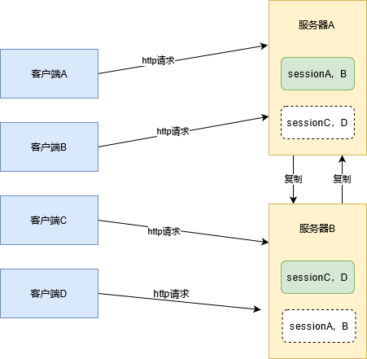
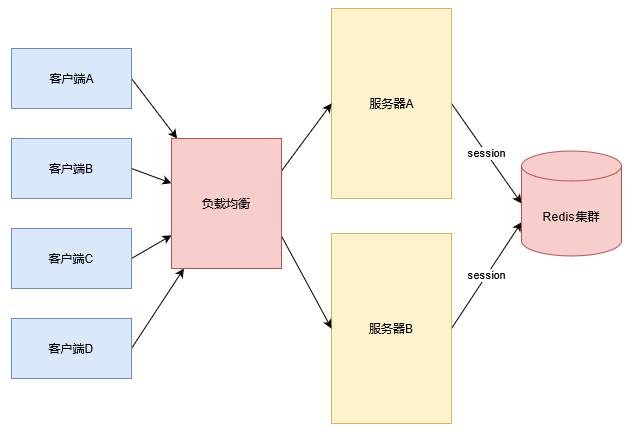

# 分布式会话

## 为什么要分布式会话

所谓分布式会话，是指在分布式系统中，用户的会话数据可以被多个服务器共享。在传统的单体应用中，用户的会话数据是存储在单个服务器上的，这样就可以很方便的实现会话共享。但是在分布式系统中，用户的请求可能会被不同的服务器处理，这就导致了会话数据无法共享的问题。

为了解决这个问题，研发者逐渐探索出了几套方案，比如：

- 会话去中心化，即将会话数据存储在客户端，而不是存储在服务器端。
- 粘性会话，即将用户的请求固定到某个服务器上，这样就可以保证用户的会话数据可以被共享。
- 会话复制，即将用户的会话数据复制到所有的服务器上，这样就可以保证用户的会话数据可以被共享。
- 会话集中化，即将会话数据存储在一个独立的服务器上，这样就可以保证用户的会话数据可以被共享。

接下来我们逐步对它们进行展开。

## 会话去中心化——客户端存储

顾名思义，会话去中心化是指将会话数据存储在客户端，而不是存储在服务器端。这样就可以保证用户的会话数据可以被共享。

会话去中心化的优点是：

- 会话数据存储在客户端，不会占用服务器的内存。

当然，缺点也很明显：

- 被篡改和窃取的风险较大，为解决这个问题，需要引入加密和签名机制，增加了开发的复杂度。
- 数据量有限，因为会话数据存储在客户端，所以会话数据的大小受到客户端存储的限制。
- 增加网络传输的负担，因为会话数据存储在客户端，所以每次请求都需要将会话数据传输到服务器端。

## 粘性会话

粘性会话是指将用户的请求固定到某个服务器上，这样就可以保证用户的会话数据可以被共享。

如上图，特定用户请求经过负载均衡器后，会被固定到某个服务器上，这样就可以保证用户的会话数据可以被共享。

粘性会话的优点是：

- 简单易用，不需要额外的存储设备和软件；
- 应用程序无需改造，只需要在负载均衡层控制即可；

缺点也很明显：

- 服务器故障时，会话数据丢失；
- 服务器负载不均衡，可能会导致某台服务器负载过高；
- 无法动态扩容，当服务器负载过高时，无法动态增加服务器；

顺便提一下，粘性会话的通用实现方式有两种：

- 基于`IP`的粘性会话，即将用户的请求固定到某个`IP`上；
- 基于`Cookie`的粘性会话，即将用户的请求固定到某个`Cookie`上；

还有其他的负载策略，这里我们就不展开了。

## 会话复制

会话复制是指将用户的会话数据复制到所有的服务器上，这样就可以保证用户的会话数据可以被共享。

如上图，用户的请求经过负载均衡器后，会被复制到所有的服务器上，这样就可以保证用户的会话数据可以被共享。

会话复制的优点是：

- 服务器故障时，会话数据不会丢失；
- 服务器负载均衡，不会导致某台服务器负载过高；

缺点也很明显：

- 会话数据同步问题，当会话数据发生变化时，需要将变化同步到所有的服务器上；
- 会话数据存储问题，因为会话数据存储在所有的服务器上，所以会占用服务器的存储空间；
- 会话数据一致性问题，因为会话数据存储在所有的服务器上，所以会话数据的一致性需要开发者自己来保证；

有兴趣的同学可以去了解一下 Tomcat 如何实现会话复制。

## 会话集中化

会话集中化是指将会话数据存储在独立的会话服务器或集群上，各业务系统通过网络链接的形式存取会话信息。

如上图，用户的请求经过负载均衡器后，会直接将请求转发到应用服务器集群，涉及到会话部分，应用服务会从会话服务同步会话信息，如果有改动则应用服务器将改动更新到会话服务。

实现会话集中化的优点是：

- 不占用应用服务器资源；
- 数据的一致性；
- 会话数据的安全性；

缺点也很明显：

- 增加网络传输的负担；
- 增加系统的复杂度；业务系统有配置和改造成本；

目前，会话集中化的实现方式有很多，比如：

- Redis，redis 充当存储，将应用容器或应用服务直接接入。
- Mysql。

## 总结

本文主要介绍了分布式会话的几种实现方式，分析了其各自的优缺点，通过对比可以发现，不同的实现方式适用于不同的场景，开发者可以根据自己的业务需求来选择合适的实现方式。

当然，目前用得比较多的是会话集中化，因为它可以很好的解决会话数据的一致性和安全性问题，而且不会占用应用服务器的资源。后续的章节我们将重点介绍该方案的实现方式。
